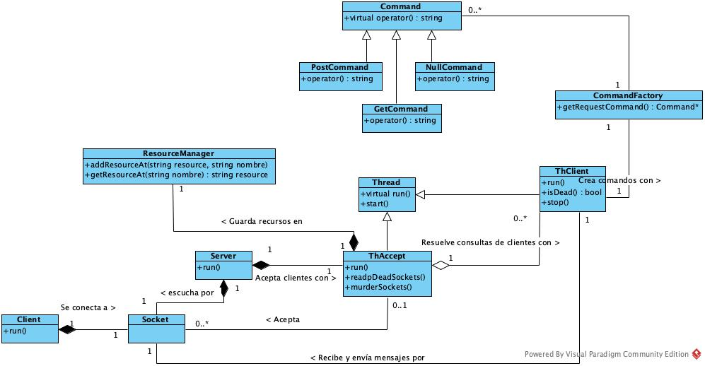

 Taller de Programacion 1 Veiga
## Trabajo Práctico 3 Taller Pages

Alumno: Robinson Fang

Padrón: 97009

Repositorio: https://github.com/fangrobinson/taller-de-programacion-1-veiga-tp3-taller-pages

## Introducción

#### Objetivo

El objetivo de este trabajo práctico es desarrollar una aplicación servidor que atenderá petitorios HTTP, mediante los cuales podrá acceder y dar alta a recursos del mismo.

#### Consideraciones particulares

1. Los métodos soportados serán únicamente GET y POST
2. Se deberá indicar por pantalla en caso que se reciba un método no soportado.
3. Se puede asumir que los petitorios siempre respetan el protocolo HTTP.
4. En el protocolo se cambiaron los saltos de linea “\r\n” por “\n”.

#### Resultados posibles para la ejecución de un Servidor

El servidor devolverá 0 si su ejecución fue exitosa. Si la cantidad de parámetros es incorrecta, se cancela la ejecución y se devuelve 1. 

#### Resultados posibles para la ejecución de un Cliente

El cliente deberá devolver siempre 0.

### Historias de usuario y Criterios de Aceptación

Se detallan algunos escenarios importantes en la resolución del trabajo práctico. En particular las respuestas esperadas por las operaciones de cliente y servidor, como así también el comportamiento que debe resolver de forma concurrente a la hora de agregar o consulta recursos. 

Client-US-1: Como cliente quiero poder pedir un recurso de un servidor para ver su contenido.

Client-US-1-CA1: 
Escenario Pido un recurso válido. 
Dado que pido a un servidor un recurso válido. 
Cuando el servidor tiene dicho recurso. 
Entonces obtengo el recurso y se me notifica.

Client-US-1-CA2: 
Escenario Pido un recurso válido, pero no disponible. 
Dado que pido a un servidor un recurso válido. 
Cuando el servidor no tiene dicho recurso. 
Entonces no obtengo el recurso.

Client-US-2: Como cliente quiero poder subir un recurso a un servidor para que esté disponible en el mismo.

Client-US-2-CA1: 
Escenario Subo un recurso válido en directorio válido. 
Dado que subo a un servidor un recurso válido en un directorio válido. 
Cuando el servidor permite subir un recurso en el directorio indicado.
Entonces subo el recurso al servidor y se me notifica.

Client-US-2-CA2: 
Escenario Subo un recurso válido, pero el directorio raíz. 
Dado que subo a un servidor un recurso válido en el directorio raíz. 
Cuando el servidor no permite subir un recurso en el directorio raíz.
Entonces no subo el recurso al servidor y obtengo un mensaje de error..

Server-US-1: Como servidor quiero aceptar petitorios GET en protocolo HTTP para disponibilizar mis recursos a mis usuarios.

Server-US-1-CA1: 
Escenario Recibo un petitorio GET con recurso válido.
Dado que recibo un petitorio GET.
Cuando el recurso está disponible.
Entonces el recurso pedido y notifico que se ha pedido ese recurso.

Server-US-1-CA2: 
Escenario Recibo un petitorio GET con recurso inválido.
Dado que recibo un petitorio GET.
Cuando el recurso no está disponible.
Entonces no entrego el recurso pedido.

Server-US-2: Como servidor quiero aceptar petitorios POST en protocolo HTTP para obtener recursos de mis usuarios.

Server-US-2-CA1: 
Escenario Recibo un petitorio POST con directorio válido.
Dado que recibo un petitorio POST.
Cuando el directorio permite escritura.
Entonces actualizo el recurso pedido y notifico que se ha subido ese recurso.

Server-US-2-CA2: 
Escenario Recibo un petitorio POST con directorio inválido.
Dado que recibo un petitorio POST.
Cuando el directorio no permite escritura.
Entonces actualizo no el recurso pedido y notifico que el directroio no permite ser escrito.

ResourceManager-US-1: Como Manager de Recursos quiero poder agregar un recurso para permitir consultas sobre él.

ResourceManager-US-1-CA1: 
Escenario Agregar un recurso y estoy bloqueado
Dado que agrego un recurso
Cuando se está realizando otra operación
Entonces espero a que termine la operación anterior y actualizo el recurso pedido.

ResourceManager-US-2: Como Manager de Recursos quiero poder entregar un recurso consultado para disponibilizarlos a mis usuarios.

ResourceManager-US-1-CA1: 
Escenario Consultar un recurso y estoy bloqueado
Dado que consulto un recurso
Cuando se está realizando otra operación
Entonces espero a que termine la operación anterior y respondo la consulta.

### Entidades que modelan la solución del trabajo práctico

La solucióin fue confeccionada siguiendo el siguiente modelo:

#### Client

Modela el comportamiento necesario para un usuario que quiere realizar consultas u operaciones sobre un servidor HTTP que soporta los comandos GET y POST. Se leen de entrada estándar tanto los métodos como los contenidos de estos petitorios.

#### Socket

Modelan la entidad socket que permite utilizar los métodos que provee el sistema para el envío y recepción de mensajes. 

#### Command - GetCommand - PostCommand - NullCommand

Command modela la ejecución de un petitorio abstracto. Define la interfaz que deben poder soportar todos los petitorios a futuro. 

Tanto GetCommand, PostCommand y NullCommand resuelven las consultas de manera polimórfica por medio de la sobrecarga del operador paréntesis con los datos que obtuvieron en sus respectivos constructores.

En el caso de NullCommand el comportamiento modelado es el de un petitorio incorrecto.

#### Command Factory

Esta entidad se encarga de la correcta construcción de un petitorio a resolver. 

#### LineParser

Encapsula las tareas de parseo de contenidos de los petitorios HTTP. Que se asumen completos aunque puedan tener contenidos inválidos.

#### Resource Manager

Es una entidad compartida que núclea la responsabilidad de modelar los recursos sobre los cuales se consultarán para responder petitorios de los clientes. Permite agregar recursos o consultar recursos de manera thread-safe.

#### Server

Se encarga de manejar el envío y la recepción de los mensajes de petitorios HTTP que debe resolver, pero delega esta responsabilidad en el ThAccept. En rigor de su comportamiento se queda esperando por entrada estándar el caracter 'q' que indica la interrupción del programa.

#### Thread

Modela el comportamiento abstracto de los hilos que son necesarios para resolver de forma concurrente el trabajo práctico.

#### ThAccept

Sobreescribe el método run() de Thread con la implementación que resuelve la aceptación de nuevos clientes, el purgado de clientes en estado 'zombie' y la correcta interrupción y desalojo de los recursos de los hilos de clientes. 

#### ThClient

Sobreescribe el método run() de Thread con la implementación que resuelve la consulta de un petitorio HTTP de un cliente. 

## Resultado

Todas las pruebas tanto públicas como privadas son ejecutadas satisfactoriamente. 

Fueron realizados los chequeos correspondientes con valgrind, address sanitizer, cppcheck y cpplint.

